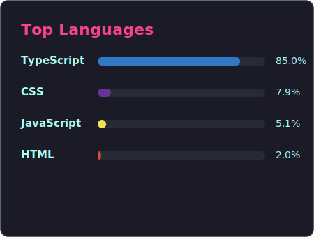

# Role:

  

# About Me:
Starting fresh each time matters most to the writer, whose journey began following the **[Frontend Roadmap](https://roadmap.sh/frontend)** before moving into **[Backend Roadmap](https://roadmap.sh/backend)** and **[DevOps Roadmap](https://roadmap.sh/devops)**  work. Instead of staying stuck on what runs in browsers, they now shape **server logic using Node.js, pair it with Express for structure, then store info flexibly via MongoDB.** Efficiency comes alive through **Docker’s containers, and GitHub Actions** handle repetitive steps without constant oversight. Beyond familiar paths, new tools appear - **PostgreSQL, MySQL, even Go and many more- as signs point toward broader tech choices outside just MERN setups**. Learning happens sharply when tangled problems give way to clean results, often alongside others pitching in their strengths. Success feels different after long stretches of trial, debugging late hours, and finally seeing code behave as intended.

## Socials:
        
# Tech Stack:
#### Languages & Core:
     

#### Frontend Frameworks & Modern UI:
      

#### State & Logic:
   

#### UI/UX:
  

#### Testing Suite:
  

#### DevOps & Tools:
        

### Code Quality & DX:
  

# GitHub Stats:
 
 

# Language Stats:

  

## ✍️ Random Dev Quote

